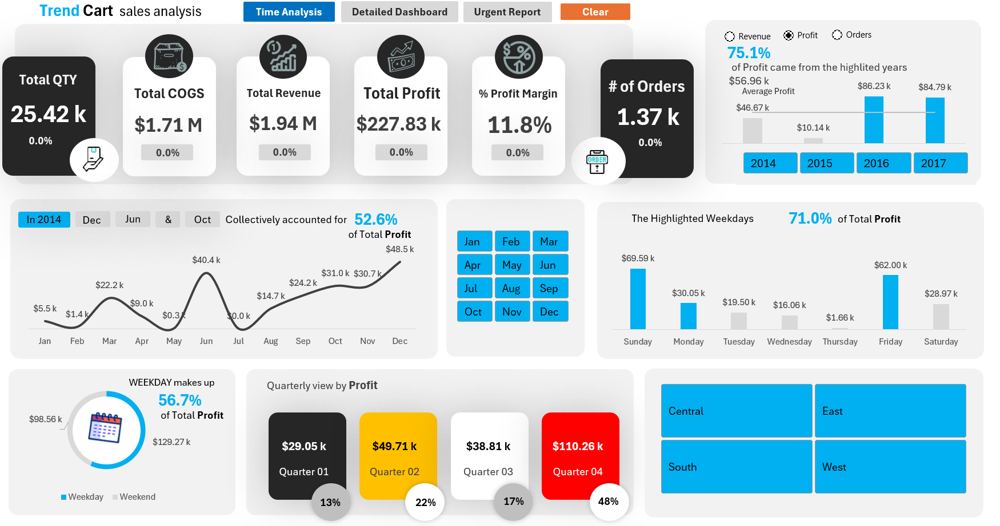
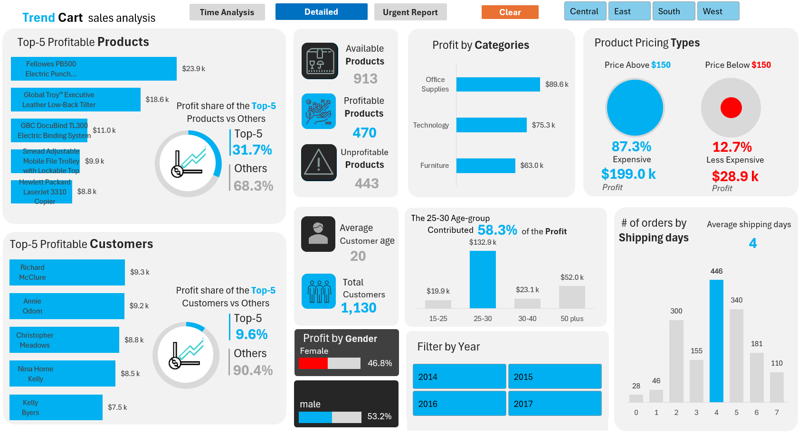
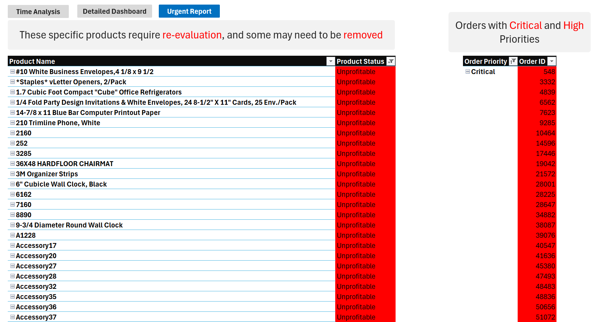

<!-- ----------------------------------------------
 README | Trend Cart — Sales Analysis in Excel
 Author: ELSAHM 32 • Updated: 2025‑06‑18
------------------------------------------------ -->

<h1 align="center">📊 Trend Cart — Interactive Sales Analysis Dashboard (Excel)</h1>

  
  
  

> **Excel portfolio project** showcasing the full analytics workflow—from raw sales data to business‑ready insights—within a single Excel workbook.  
> Built using Power Query, Power Pivot, and DAX, with enhanced user experience through a macro button for **1‑click slicer reset**.

---

## 🚀 Why This Project Matters
| Business Value                          | How I Delivered It                            |
|----------------------------------------|-----------------------------------------------|
| Clear performance tracking (sales, profit, trends) | KPIs + interactive visual dashboards |
| Instant answers to when, what, who, why | Time filters, top-N analysis, customer/product insights |
| Clean data model for fast reporting     | Dim/fact tables, calendar table, optimized relationships |
| User-friendly navigation & refresh      | Macro button resets all slicers in a click |

This project demonstrates **real‑world Excel skills** beyond formulas: data cleaning, model design, DAX measures, dashboard layout, and user interactivity.

---

## ✨ Visual Preview

| Time Analysis | Detailed Dashboard | Urgent Report |
|---------------|-------------------|---------------|
|  |  |  |

---

## 🛠️ Tools & Skills Demonstrated

- ✅ Power Query for data loading, transformation, and cleaning  
- ✅ Power Pivot to build a star schema and manage relationships  
- ✅ DAX formulas for dynamic KPI calculations (YoY, MoM, ranking)  
- ✅ Pivot Charts & Slicers for interactivity  
- ✅ **Macro button** (via recorded macro) to **clear all slicers**  
- ✅ Time intelligence and product segmentation

---

## 📊 Dashboard Highlights

- **Time Analysis View**: Sales & profit trends by month, seasonality, weekday impact  
- **Detailed Dashboard**: Top products, top customers, profit breakdowns, segments  
- **Urgent Report View**: Flags unprofitable products, key issues, and business alerts  
- **Interactivity**: Slicers for quick filtering by time, product category, customer age, and more  
- **1‑Click Reset**: A macro-enabled button clears all slicers instantly  

---

## 📌 Key Insights & Recommendations

| # | Insight (from Dashboard) | Actionable Recommendation |
|---|--------------------------|---------------------------|
| 1 | **Profit margin = 11.8 %** on \$1.94 M revenue. | Negotiate supplier discounts & adjust pricing on low‑elastic SKUs. |
| 2 | **Q4 → 48 %** of yearly profit; spikes in **June & December**. | Align inventory & marketing; launch mid‑year promos each **June**. |
| 3 | **Weekdays → 56.7 %** of profit; **Friday** alone \$62 k. | Schedule flash sales & e‑mail blasts every **Friday**. |
| 4 | **25‑30 age group → 58.3 %** of profit. | Double‑down on social advertising (TikTok/Instagram) & loyalty perks. |
| 5 | **4‑day shipping peak (446 orders)**. | Introduce premium next‑day option and renegotiate SLAs for standard tier. |
| 6 | **87.3 % profit from >\$150 items; 48.5 % SKUs unprofitable.** | Discontinue red‑flag SKUs, upsell high‑value bundles. |
---

## 📂 Project Structure
